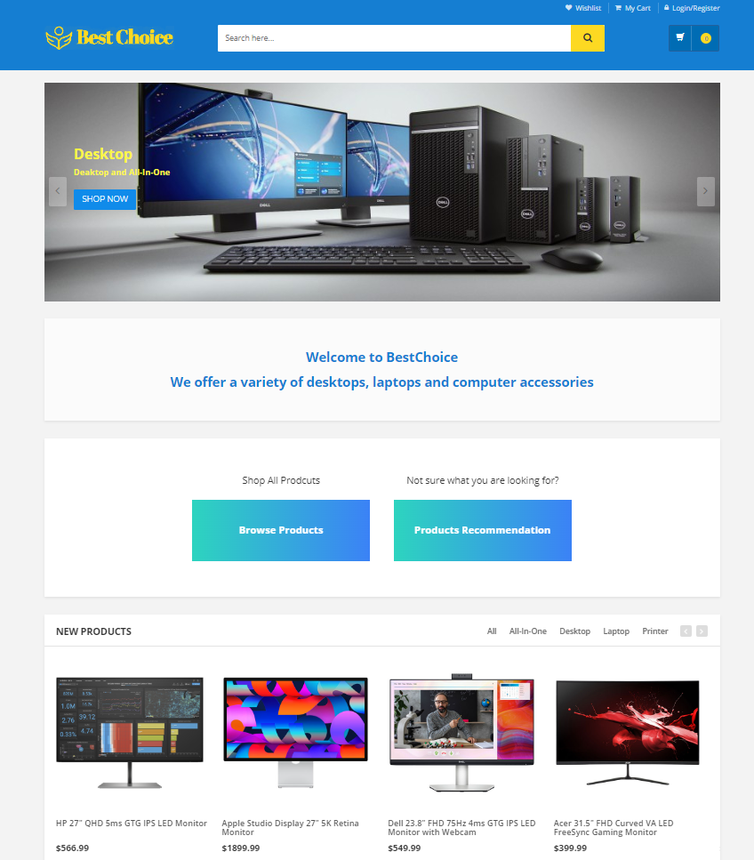
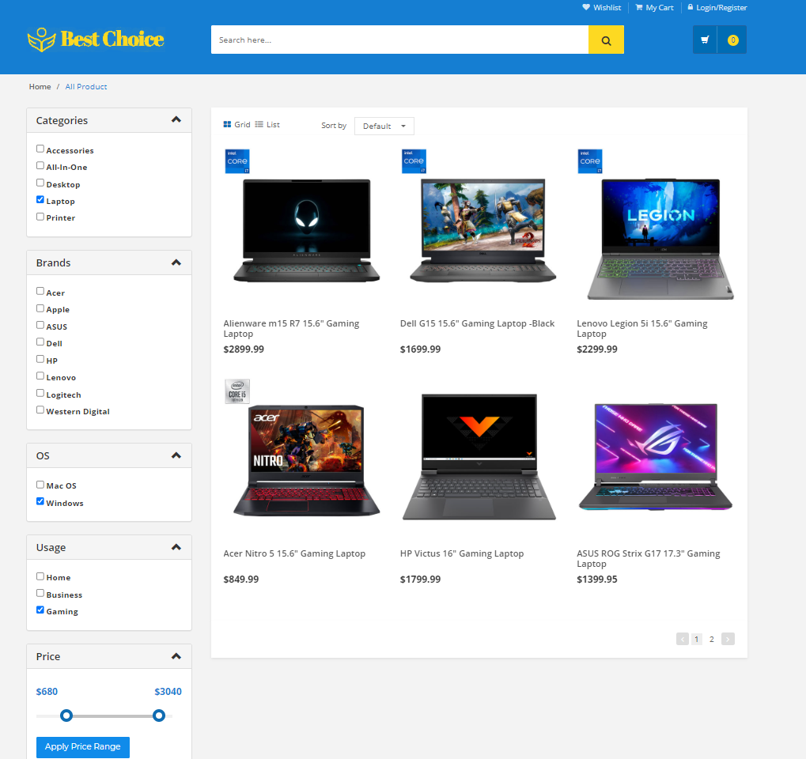

<!-- PROJECT SHIELDS -->

<!--
*** I'm using markdown "reference style" links for readability.
*** Reference links are enclosed in brackets [ ] instead of parentheses ( ).
*** See the bottom of this document for the declaration of the reference variables
*** for contributors-url, forks-url, etc. This is an optional, concise syntax you may use.
*** https://www.markdownguide.org/basic-syntax/#reference-style-links
-->

Full-stack e-commerce website that includes an inventory management system and live chat support  

### Key Features
- Secure user authentication with email verification
-  Personalized product recommendations based on user preferences and budget
- Comprehensive product catalog with search and filter functionalities
-  Integrated payment gateway powered by Stripe API
-  Admin dashboard with role-based access control for managing users, products, and orders
-  Sales reports and analysis charts using ApexCharts.js
-  Built-in live chat function using the Workman Socket framework

#### Built With 
[![Laravel][Laravel.com]][Laravel-url] [![MySQL][MySQL.com]][MySQL.url] [![Stripe][Stripe.com]][Stripe-url]  [![JQuery][JQuery.com]][JQuery-url] [![Bootstrap][Bootstrap.com]][Bootstrap-url]  [![html][html.com]][html.url]  [![css][css.com]][css.url]  

<b><a  href="http://43.139.103.72:8115/">View Demo</a></b>              $~~~~~~$ Credentials： ``frankf@gmail.com``  $~~$    `Test12345`

<b><a  href="http://43.139.103.72:8115/admin/login"> Admin Login</a></b>   $~~~~$ Credentials： ``test_admin@gmail.com``  $~~$    `Admin12345` 

 

   

   

### Installation and Setup

- Clone the repository
- Install dependencies using `composer install`
- Create a `.env` file by copying the `.env.example` file and set the required environment variables
- Generate a new application key using `php artisan key:generate`
- Migrate the database using `php artisan migrate`
- Seed the database using `php artisan db:seed`
- Start the server using `php artisan serve`

<!-- MARKDOWN LINKS & IMAGES -->

<!-- https://www.markdownguide.org/basic-syntax/#reference-style-links -->

[contributors-shield]: https://img.shields.io/github/contributors/github_username/repo_name.svg?style=for-the-badge

[contributors-url]: https://github.com/github_username/repo_name/graphs/contributors

[forks-shield]: https://img.shields.io/github/forks/github_username/repo_name.svg?style=for-the-badge

[forks-url]: https://github.com/github_username/repo_name/network/members

[stars-shield]: https://img.shields.io/github/stars/github_username/repo_name.svg?style=for-the-badge

[stars-url]: https://github.com/github_username/repo_name/stargazers

[issues-shield]: https://img.shields.io/github/issues/github_username/repo_name.svg?style=for-the-badge

[issues-url]: https://github.com/github_username/repo_name/issues

[license-shield]: https://img.shields.io/github/license/github_username/repo_name.svg?style=for-the-badge

[license-url]: https://github.com/github_username/repo_name/blob/master/LICENSE.txt

[linkedin-shield]: https://img.shields.io/badge/-LinkedIn-black.svg?style=for-the-badge&logo=linkedin&colorB=555

[linkedin-url]: https://linkedin.com/in/linkedin_username

[product-screenshot]: images/screenshot.png

[Next.js]: https://img.shields.io/badge/next.js-000000?style=for-the-badge&logo=nextdotjs&logoColor=white

[Next-url]: https://nextjs.org/

[React.js]: https://img.shields.io/badge/React-20232A?style=for-the-badge&logo=react&logoColor=61DAFB

[React-url]: https://reactjs.org/

[Vue.js]: https://img.shields.io/badge/Vue.js-35495E?style=for-the-badge&logo=vuedotjs&logoColor=4FC08D

[Vue-url]: https://vuejs.org/

[Angular.io]: https://img.shields.io/badge/Angular-DD0031?style=for-the-badge&logo=angular&logoColor=white

[Angular-url]: https://angular.io/

[Svelte.dev]: https://img.shields.io/badge/Svelte-4A4A55?style=for-the-badge&logo=svelte&logoColor=FF3E00

[Svelte-url]: https://svelte.dev/

[Laravel.com]: https://img.shields.io/badge/Laravel-FF2D20?style=for-the-badge&logo=laravel&logoColor=white

[Laravel-url]: https://laravel.com

[Bootstrap.com]: https://img.shields.io/badge/Bootstrap-563D7C?style=for-the-badge&logo=bootstrap&logoColor=white

[Bootstrap-url]: https://getbootstrap.com

[JQuery.com]: https://img.shields.io/badge/jQuery-0769AD?style=for-the-badge&logo=jquery&logoColor=white

[JQuery-url]: https://jquery.com

[Stripe.com]:https://img.shields.io/badge/Stripe-626CD9?style=for-the-badge&logo=Stripe&logoColor=white
[Stripe-url]: https://stripe.com/

[MySQL.com]:https://img.shields.io/badge/MySQL-005C84?style=for-the-badge&logo=mysql&logoColor=white
[MySQL.url]:https://www.mysql.com/

[html.com]:https://img.shields.io/badge/HTML5-E34F26?style=for-the-badge&logo=html5&logoColor=white
[html.url]:https://html.com/

[css.com]:https://img.shields.io/badge/CSS3-1572B6?style=for-the-badge&logo=css3&logoColor=white
[css.url]:https://html.com/
